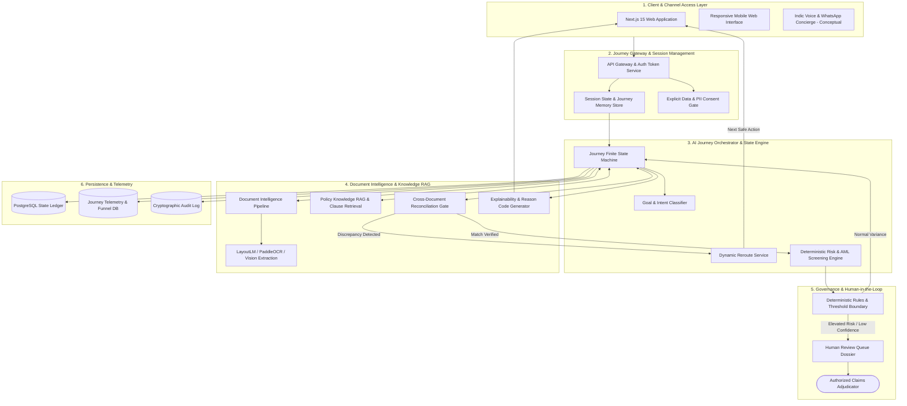
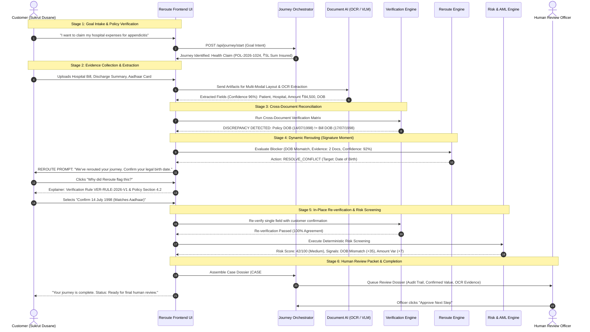

# REROUTE — AI-Powered Financial Journey Engine

> **"Don't restart. Reroute."**  
> An AI-powered Financial Journey Engine that guides customers from goal to completion by understanding intent, verifying documents, detecting discrepancies, and dynamically rerouting to the safest next action.

---

## 1. Problem Statement
Financial journeys across insurance claims, lending, and fintech onboarding are notoriously fragmented, complex, and process-heavy. Traditional web portals function as rigid, unforgiving waterfalls:
- **Jargon & Form Overload:** Customers are expected to understand internal product taxonomies, policy exclusions, deductibles, and waiting periods before even starting.
- **Fragile Verification & Cold Rejections:** A minor typo or discrepancy across documents (e.g., a mismatch in Date of Birth or patient name between hospital invoice and policy) triggers a cold *"Application Incomplete"* or automatic rejection.
- **Preventable Drop-offs:** Customers frequently abandon valid claims or credit journeys when rigid waterfall processes fail to recover from minor document discrepancies or require restarting from scratch.

---

## 2. The Solution: The Reroute Paradigm
**Reroute** reimagines financial processes as an intelligent, adaptive journey engine. Instead of forcing customers to navigate rigid forms:
1. **Goal-First Intake:** Customers state their goal in plain language (*"I want to claim my hospital expenses for appendicitis surgery"*).
2. **Journey State Tracking:** The engine maintains an explicit state machine, tracking what is verified and what evidence remains.
3. **Document Intelligence:** OCR & Vision models extract structured entities with field-level confidence scores.
4. **Dynamic Rerouting:** When a conflict or missing document arises, the system **never restarts**—it isolates the exact blocker and **reroutes** the customer to the safest next action.
5. **Zero Autonomous Financial Approvals:** Compliant with responsible AI norms; Reroute assists, verifies, and packages evidence for human adjudicators.

---

## 3. Detailed Architecture Diagram

The system operates across six decoupled layers ensuring zero hallucination, deterministic safety gates, and auditability.



---

## 4. Detailed Workflow Diagram

The sequence below illustrates the end-to-end Health Insurance Claim journey, showing the deliberate Date of Birth mismatch, the signature Reroute intervention, and seamless recovery.



---

## 5. Comprehensive Tools & Technologies Used

A complete catalog of all frameworks, libraries, open-source models, and architectural tools powering Reroute:

### A. Frontend & User Experience
| Tool | Version / Source | Purpose in Reroute |
| :--- | :--- | :--- |
| **Next.js** | `v15.5.x` (App Router) | High-performance server rendering, static optimization, and routing |
| **React** | `v19.1.x` | Modern reactive component architecture and concurrent transitions |
| **TypeScript** | `v5.6.x` | End-to-end domain type safety across journeys, conflicts, and claims |
| **Tailwind CSS** | `v3.4.x` | Utility-first styling with custom Neo-Brutalist color tokens and border classes |
| **Lucide React** | `v0.468.x` | Consistent, accessible technical fintech iconography |
| **Space Grotesk** | Google Fonts | Primary bold geometric sans-serif typeface |
| **DM Mono** | Google Fonts | Technical monospace typeface for codes, currency, and timestamps |

### B. UI Primitives & Interactive Visualizations
| Tool | Source / Ecosystem | Purpose in Reroute |
| :--- | :--- | :--- |
| **shadcn/ui & Radix UI** | [shadcn/ui](https://github.com/shadcn-ui/ui) | Accessible, unstyled primitives for modals, drawers, and tooltips |
| **Recharts** | [recharts](https://github.com/recharts/recharts) | Conversion funnel visualization and friction metrics comparisons |
| **xyflow / React Flow** | [React Flow](https://github.com/xyflow/xyflow) | (Recommended) Interactive node graph visualization of evidence dependencies |
| **Custom Shell & Cursor** | Built-in | Subtle interactive mouse tracking and responsive background grid |

### C. Orchestration, Document Intelligence & RAG
| Tool | Category | Implementation & Role |
| :--- | :--- | :--- |
| **Reroute State Engine** | Core Service | Deterministic state machine managing step transitions and blockers |
| **Dynamic Reroute Service** | Core Engine | Evaluates state and generates minimal-friction recovery actions |
| **PaddleOCR / Tesseract** | Document AI | Layout-aware text and field extraction from invoices and ID proofs |
| **Microsoft Presidio** | Privacy / PII | Client/gateway redaction of sensitive identifiers (Aadhaar/PAN) |
| **pgvector / Qdrant** | Vector Store | Embeddings storage and hybrid retrieval for policy specifications |
| **LangGraph / Temporal** | Orchestration | Stateful workflow orchestration with checkpointing and human-in-the-loop |

### D. Risk Intelligence, Policy & Governance
| Tool | Category | Implementation & Role |
| :--- | :--- | :--- |
| **Risk Intelligence Engine** | Fraud / AML Screening | Additive scoring algorithm (0–100) with explainable signals |
| **Policy Knowledge Base** | Regulatory Rules | Grounded Markdown policies (`claim-requirements`, `verification-rules`) |
| **Explainable AI Engine** | Trust & Transparency | Grounded plain-language citations with clause citations and confidence % |
| **Officer Review Queue** | Human Oversight | Pre-assembled dossiers with customer confirmation audit trails |

### E. Hackathon Ecosystem Integrations
| Tool | Ecosystem Partner | Hackathon Integration Opportunity |
| :--- | :--- | :--- |
| **Sarvam AI** | Sarvam Platform | Indic-language speech-to-text, text-to-speech, and regional translation |
| **n8n** | n8n Automation | Low-code workflow webhook automation and notification dispatch |
| **Cognee** | Knowledge Graph | Entity-relationship graphs connecting policyholder → hospital → claim |

---

## 6. Document Structure & Synthetic Schema

All synthetic documents in Reroute follow structured, auditable schemas:
- **Policy Schedule (`Policy_Schedule_POL1024.pdf`):** Contains policyholder legal name, birth date, sum insured (`₹5,00,000`), room rent cap (`₹5,000/day`), and waiting period clauses.
- **Hospital Invoice (`Hospital_Bill_CityCare_84500.pdf`):** Inpatient bill containing admission/discharge timestamps, itemized room/surgical fees, and the deliberate mismatch date (`17/07/1998`).
- **Clinical Discharge Summary (`Discharge_Summary_Sukrut_Aug2026.pdf`):** Medical proof detailing diagnosis (*Acute Appendicitis*), procedure (*Laparoscopic Appendectomy*), and surgeon details.
- **Government Photo ID (`Aadhaar_Card_Masked_Sukrut.pdf`):** Official identity benchmark containing verified Date of Birth (`14/07/1998`) used for Reroute confirmation.

*For comprehensive schema details, field bounding boxes, and cross-reconciliation rules, see [`docs/DOCUMENT_STRUCTURE.md`](file:///Users/sukrutdusane/Documents/Projects%20/Sy/ReRoute/docs/DOCUMENT_STRUCTURE.md).*

---

## 7. The 5-Minute Hackathon Judging Flow

Judges can execute this exact sequence to experience the product differentiator without external API dependencies:

1. **Open ReRoute:** Visit `http://localhost:3000` (or demo URL).
2. **Review the Hero:** Observe the headline *"Financial journeys shouldn't feel like a maze"* and the live case preview (`CASE #R-1024`).
3. **Start Journey:** Click **START A JOURNEY** (routes to `/journey`).
4. **Goal Intake:** Customer enters *"I want to claim my hospital expenses for appendicitis surgery."* Click **CONTINUE WITH GOAL →**.
5. **Entitlement Check:** Journey identifies Health Insurance Claim under Policy `POL-2026-1024` with ₹5,00,000 active coverage.
6. **Evidence Collection:** Synthetic documents loaded: Policy Schedule, Hospital Bill, Discharge Summary, and Photo ID.
7. **Document Intelligence Extraction:** OCR character confidence extracted across all medical and financial fields.
8. **Discrepancy Detection:** Verification highlights Date of Birth conflict: Policy recorded `14/07/1998` vs Hospital recorded `17/07/1998`.
9. **Explainability Modal:** Click **"Why did ReRoute flag this?"** to inspect the root cause: *"Critical identity information must remain consistent across claims and policy records."*
10. **The Reroute Moment:** ReRoute activates the in-place `ReroutePanel` (`CURRENT STATE: Verification blocked`, `ISSUE: DOB mismatch`, `CONFIDENCE: 92%`).
11. **Customer Resolution:** Customer confirms `14/07/1998 (Matches Aadhaar & Policy)`.
12. **In-Place Recovery:** Re-verification succeeds immediately without document re-upload or restarting the claim.
13. **Risk Intelligence & Traceable Arithmetic:** Risk score displays deterministic arithmetic:
    - `DOB mismatch`: `+35`
    - `Amount anomaly`: `+7`
    - `Duplicate document`: `+0`
    - `OCR quality`: `+0`
    - `Claim frequency`: `+0`
    - **Total:** `42 / 100 (Medium Risk)`
14. **Human Review Governance:** Inspection dossier prepared under strict oversight: `AI DETECTS → AI EXPLAINS → REROUTE RECOMMENDS → HUMAN REVIEWS → HUMAN DECIDES → JOURNEY CONTINUES`.
15. **Journey Completion:** Case summary assembled with clean audit trail and zero autonomous payout releases.
16. **Telemetry Verification (`/dashboard`):** Inspect the operations dashboard showing 84.6% resolution rate, drop-off analysis, and synthetic benchmarks.

---

## 8. Four Demo Scenarios (Demo Mode Switcher)
Click the **DEMO MODE** switcher at the top of `/journey` for instant, leak-free scenario resets:
- **01 · DOB Conflict (Default / Core Demo):** Staged discrepancy → in-place Reroute → customer confirmation → resumption.
- **02 · Happy Path:** All 4 documents match; skips reroute and fast-tracks directly to review preparation.
- **03 · Missing Evidence:** Discharge summary omitted; Reroute informs user exactly what is needed without rejection.
- **04 · Risk Signal:** High-ticket claim (₹1,85,000) triggers elevated risk score (68/100) and automatic escalation to human adjudicator queue.

---

## 9. AI Safety & Regulatory Compliance
- **Zero Autonomous Financial Approvals:** ReRoute coordinates, assists, and packages evidence; it does not autonomously approve, reject, underwrite, or disburse funds.
- **Deterministic Guardrails:** Risk scoring and rerouting rules are deterministic, preventing probabilistic LLM hallucinations in critical paths.
- **Synthetic Data Guarantee:** All names, policies, claim amounts, and hospital records are strictly synthetic demo benchmarks.
- **PII Protection:** Identifiers are masked (`VID: XXXX-XXXX-4912`); no live credentials or real national IDs are stored.

---

## 10. Repository Directory Structure

```text
ReRoute/
├── app/
│   ├── page.tsx                    # Composition-only Landing Page
│   ├── layout.tsx                  # Root Layout & Metadata
│   ├── globals.css                 # Tailwind & Neo-brutalist styling utilities
│   ├── journey/
│   │   └── page.tsx                # Customer Journey Engine & State Machine
│   ├── dashboard/
│   │   └── page.tsx                # Journey Intelligence & Funnel Telemetry
│   ├── risk/
│   │   └── page.tsx                # Risk Intelligence & Traceable Scoring
│   └── review/
│       └── page.tsx                # Human Review Dossier & Officer Controls
├── components/
│   ├── navbar.tsx                  # Responsive Navigation Header
│   ├── demo-banner.tsx             # 4-Scenario Instant Switcher
│   ├── explainability-modal.tsx     # Standardized Explainability Modal
│   ├── evidence-modal.tsx          # Structured Field Evidence Inspector
│   ├── landing-interactive-suite.tsx # Interactive Friction Sandbox
│   ├── marketing/                  # Modular Landing Page Architecture
│   │   ├── hero-section.tsx
│   │   ├── live-case-preview.tsx
│   │   ├── journey-pipeline.tsx
│   │   ├── problem-section.tsx
│   │   ├── reroute-section.tsx
│   │   ├── intelligence-section.tsx
│   │   ├── human-oversight-section.tsx
│   │   ├── friction-section.tsx
│   │   └── footer.tsx
│   ├── ui/
│   │   └── brutalist-card.tsx      # Standardized Neo-brutalist Card System
│   └── journey/
│       ├── journey-sidebar.tsx
│       ├── journey-context-panel.tsx
│       ├── reroute-panel.tsx       # Reusable Signature Reroute UI
│       ├── goal-step.tsx
│       ├── policy-step.tsx
│       ├── upload-step.tsx
│       ├── extraction-step.tsx
│       ├── verification-step.tsx
│       ├── conflict-reroute-step.tsx
│       ├── risk-step.tsx
│       ├── completion-step.tsx
│       └── interactive-journey-sandbox.tsx
├── lib/
│   ├── types.ts                    # TypeScript Domain Interfaces & Types
│   ├── reroute-engine.ts           # Deterministic Reroute & Safe Next Action Logic
│   ├── risk-engine.ts              # Risk Intelligence with Arithmetic Breakdown
│   └── synthetic-data.ts           # Pre-populated Demo Scenarios & Knowledge Bases
├── data/
│   ├── policies/                   # Markdown Policy & Verification Specifications
│   └── synthetic/                  # JSON Datasets (customers, journeys, claims, analytics)
├── docs/                           # Architecture, Flow & Product Specifications
└── package.json
```

---

## 11. Local Installation & Development

```bash
# 1. Clone the repository
git clone https://github.com/sukrut07/ReRoute.git
cd ReRoute

# 2. Install dependencies
npm install

# 3. Start development server
npm run dev

# 4. Open browser
# Navigate to http://localhost:3000
```
