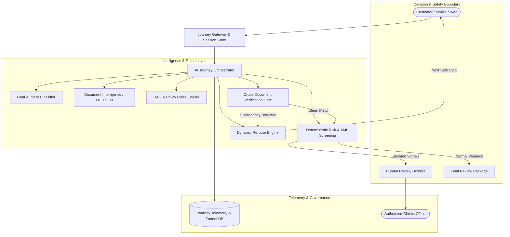

# REROUTE — AI-Powered Financial Journey Engine

> **"Don't restart. Reroute."**  
> An AI-powered Financial Journey Engine that guides customers from goal to completion by understanding intent, verifying documents, detecting discrepancies, and dynamically rerouting to the safest next action.

---

## Problem
Financial journeys across insurance, lending, and banking are notoriously fragmented, complex, and process-heavy. Traditional web portals are rigid waterfalls:
- **Jargon & Form Overload:** Customers are expected to understand internal product taxonomies, policy clauses, and waiting periods.
- **Fragile Verification:** A minor typo or discrepancy across documents (e.g. a mismatch in Date of Birth or patient name) triggers a cold *"Application Incomplete"* or rejection notice.
- **High Abandonment:** Over 38% of customers abandon valid claims or credit journeys because recovery requires phone support or restarting from scratch.

## Solution
**Reroute** reimagines financial processes as an intelligent, adaptive journey engine. Instead of forcing customers to navigate rigid forms:
1. Customers state their goal in plain language (*"I want to claim my hospital expenses"*).
2. The engine tracks journey state and identifies required evidence.
3. Document Intelligence extracts structured data with confidence scores.
4. When a conflict or anomaly arises, the system **never restarts**—it isolates the issue and **reroutes** the customer to the exact safe action needed to continue.
5. All actions remain fully explainable, bounded by deterministic safety rules and human oversight.

---

## Core Flow

```text
CUSTOMER GOAL
      ↓
JOURNEY STATE
      ↓
COLLECT EVIDENCE
      ↓
VERIFY & CROSS-CHECK
      ↓
RISK & CONFLICT CHECK
      ↓
     ┌────────────────────────┐
     │                        │
  COMPLETE                 CONFLICT
                              ↓
                           REROUTE
                              ↓
                       SAFE NEXT ACTION
                              ↓
                          RE-VERIFY
                              ↓
                           COMPLETE
```

---

## Key Features

1. **Goal-Based Journey:** Natural language intent parser maps customer goals directly to regulated workflows.
2. **Journey Memory:** Preserves verified state and uploaded evidence across sessions; returning users resume right from their blocker.
3. **Document Intelligence:** OCR & Vision abstraction extracts itemized invoices, discharge summaries, and identity proofs with confidence scoring.
4. **Cross-Document Verification:** Reconciles fields across multiple artifacts (e.g. Policy Schedule, Hospital Bill, Aadhaar).
5. **Dynamic Rerouting:** The signature engine that intercepts discrepancies and generates targeted, minimal-friction resolution paths.
6. **Explainable AI ("Why?" Panels):** Every AI prompt and flagged discrepancy cites specific policy clauses, rule IDs, and confidence percentages.
7. **Transparent Risk Intelligence:** Deterministic screening for duplicate documents, claim amount anomalies, and frequency variance with transparent 0–100 scores.
8. **Human-in-the-Loop Review:** Automatically compiles audit-ready dossiers for authorized officers—zero autonomous financial adjudications.
9. **Journey Telemetry & Analytics:** Real-time visibility into conversion funnels, friction points, conflict frequencies, and step reductions.

---

## System Architecture



---

## Tech Stack

| Layer | Technologies | Purpose |
| :--- | :--- | :--- |
| **Frontend** | Next.js 15, React 19, TypeScript, Tailwind CSS | Fast, accessible Neo-Brutalist fintech UI |
| **Design System** | Space Grotesk, DM Mono, Lucide Icons, Custom Brutal Shadows | High-contrast, minimal, technical aesthetic |
| **Journey Orchestrator** | State Machine & Deterministic Reroute Service | Manages state transitions, blockers, and reroutes |
| **Risk Intelligence** | Deterministic Risk Engine & Anomaly Scoring | Synthetic scoring (Low/Medium/High) and signal audit |
| **Policy & RAG** | Synthetic Policy Markdown Specifications | Grounded citations, section references, confidence gates |
| **Telemetry** | Journey Funnel Analytics & Friction Comparison | Real-time drop-off and throughput telemetry |

---

## Main Hackathon Demo Flow

Judges can test the signature 2–3 minute interactive journey:
1. **Intake:** Customer enters *"I want to claim my hospital expenses for appendicitis surgery."*
2. **Policy Entitlement:** Policy Schedule `POL-2026-1024` verified against `₹5,00,000` base sum insured.
3. **Document Extraction:** Hospital bill, discharge summary, and ID proof extracted with 96% OCR confidence.
4. **Deliberate Conflict:** Policy records Date of Birth as **14/07/1998**, while Hospital Invoice recorded **17/07/1998**.
5. **The Reroute Moment:** Instead of failing, Reroute displays:
   > *"We've rerouted your journey. Instead of restarting your claim, we've identified exactly what needs clarification."*
6. **Customer Confirmation:** User confirms **14 July 1998** (matches Aadhaar record).
7. **Instant Recovery:** Re-verification re-evaluates the field, clears the blocker, and advances to Risk Screening.
8. **Risk Intelligence Check:** Risk Score calculated as 42/100 (Medium); signals audited.
9. **Final Dossier:** Case `#R-1024` prepared for final human sign-off; telemetry reflected live in Journey Intelligence dashboard.

---

## Quick Demo Scenarios
The live app includes a top **DEMO MODE** switcher with 4 scenarios:
- **01 · DOB Conflict (Core Demo):** Staged discrepancy → in-place Reroute → user confirmation → resumption.
- **02 · Happy Path:** All 4 documents match perfectly → instant verification → fast-track review.
- **03 · Missing Evidence:** Discharge summary missing → Reroute informs user exactly what is needed without rejection.
- **04 · Risk Signal:** High-ticket claim (₹1,85,000) + low OCR clarity → Risk Score 68/100 → Human review escalation.

---

## Synthetic Data Notice
All customer profiles, policy numbers, claim amounts, hospital invoices, and risk scores in this repository are **strictly synthetic demonstration data** created for the Paytm Build for India AI Hackathon. No real personally identifiable information (PII) or banking credentials are used or stored.

---

## AI Safety & Regulatory Compliance
- **Zero Autonomous Financial Approvals:** Reroute coordinates, assists, and packages evidence; it does not approve, reject, or underwrite claims or credit.
- **Grounded Responses:** Explanations cite synthetic policy clauses with confidence scores.
- **Deterministic Guardrails:** Risk scoring and rerouting logic are rule-governed rather than probabilistic LLM hallucinations.

---

## Project Structure

```text
ReRoute/
├── app/
│   ├── page.tsx            # Neo-Brutalist Landing Page & Product Overview
│   ├── layout.tsx          # Root Layout & Fonts
│   ├── globals.css         # Tailwind & Neo-brutalist custom styling
│   ├── journey/
│   │   └── page.tsx        # Interactive Customer Journey Engine & State Machine
│   ├── dashboard/
│   │   └── page.tsx        # Journey Intelligence & Funnel Telemetry
│   ├── risk/
│   │   └── page.tsx        # Risk Intelligence Screening Dashboard
│   └── review/
│       └── page.tsx        # Human Review Dossier & Officer Controls
├── components/
│   ├── navbar.tsx          # Responsive Header with Route Links & Badges
│   ├── demo-banner.tsx     # Scenario Switcher Bar (4 Scenarios)
│   ├── explainability-modal.tsx # "Why?" Explainable AI Panel
│   ├── evidence-modal.tsx  # Document Scan & OCR Viewer
│   └── journey/
│       ├── journey-sidebar.tsx
│       ├── goal-step.tsx
│       ├── policy-step.tsx
│       ├── upload-step.tsx
│       ├── extraction-step.tsx
│       ├── verification-step.tsx
│       ├── conflict-reroute-step.tsx
│       ├── risk-step.tsx
│       └── completion-step.tsx
├── lib/
│   ├── types.ts            # Complete TypeScript Domain Interfaces
│   ├── reroute-engine.ts   # Deterministic Reroute & Safe Next Action Logic
│   ├── risk-engine.ts      # Transparent Risk Intelligence & Anomaly Scoring
│   └── synthetic-data.ts   # Pre-populated Demo Scenarios & Knowledge Bases
├── data/
│   ├── policies/           # Markdown Policy & Verification Specifications
│   └── synthetic/          # JSON Datasets (customers, journeys, claims, analytics)
├── docs/                   # Architectural & System Documentation
└── package.json
```

---

## Installation & Local Setup

```bash
# Clone the repository
git clone https://github.com/sukrut07/ReRoute.git
cd ReRoute

# Install dependencies
npm install

# Start development server
npm run dev

# Open browser
# Navigate to http://localhost:3000
```

---

## Environment Variables
Create a `.env.local` file for production configuration:
```env
NEXT_PUBLIC_APP_ENV=development
NEXT_PUBLIC_DEMO_MODE=true
NEXT_PUBLIC_REROUTE_CONFIDENCE_THRESHOLD=0.85
```
*(No external API keys required to test the complete standalone demo experience).*
