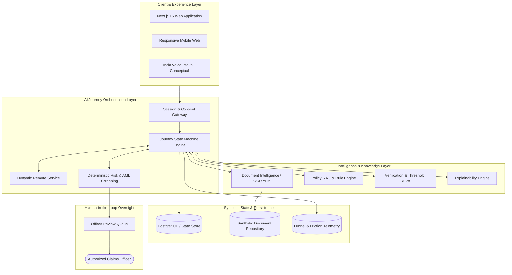

# REROUTE — System Architecture

---

## Architectural Principles

1. **Zero Hallucination Boundary:** LLMs parse intent and format plain-language explanations; deterministic rules control state transitions, verification checks, and eligibility flags.
2. **Stateful Journey Engine:** The state machine tracks current, completed, and interrupted steps. When an interrupted step occurs, the engine maintains all prior verified state.
3. **Decoupled Reroute Service:** The Reroute engine evaluates `(JourneyState, Evidence[], Conflicts[], RiskScore) → RerouteAction`. It can be invoked independently by any microservice or frontend hook.
4. **Transparent Risk Screening:** Risk scores (0 to 100) are additive and explainable, providing an audit trail for compliance teams.
