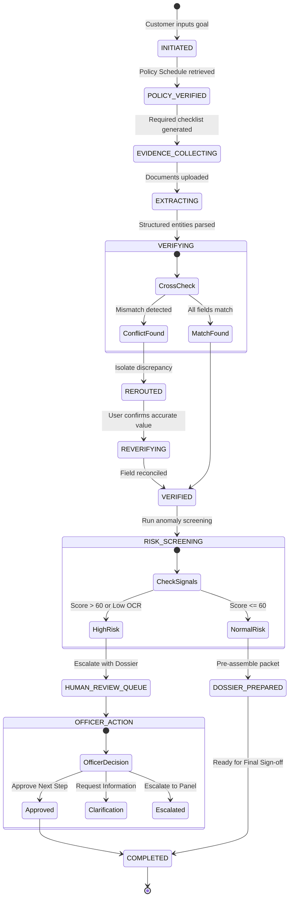
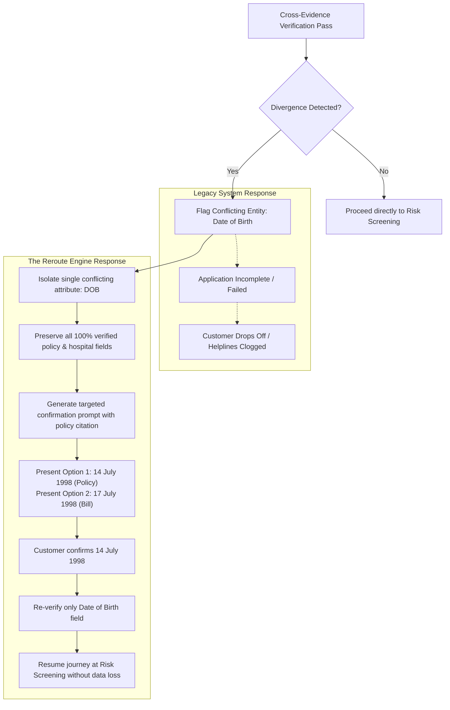
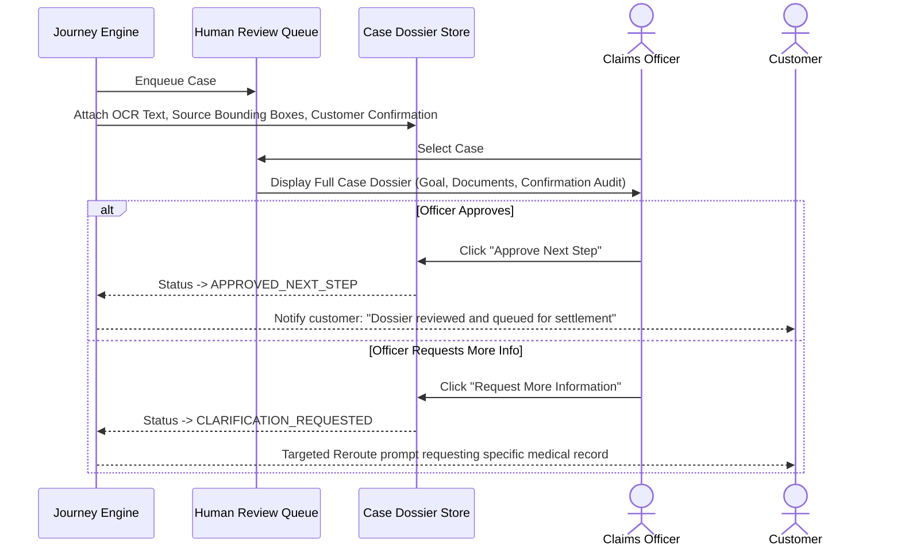

# REROUTE — Workflow Engine & State Machine Specification

This document details the lifecycle workflows, state transition logic, recovery loops, and human-in-the-loop escalation paths implemented across the Reroute Engine.

---

## 1. High-Level Lifecycle State Machine

---

## 2. Dynamic Rerouting Recovery Workflow

The diagram below demonstrates how Reroute intercepts a failure that would cause an application abort in legacy systems:

---

## 3. Human-in-the-Loop Workflow

When cases have elevated risk (> 60), low OCR confidence (< 70%), or user requests manual intervention:

